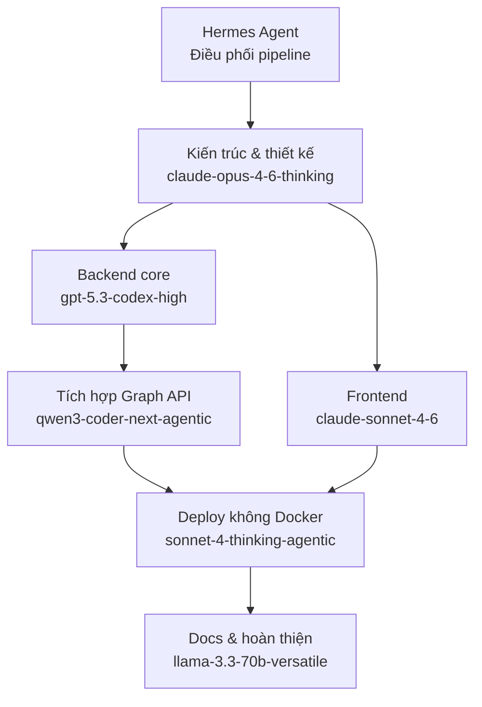

# Phân công vận hành dự án: Web quản lý tài sản

**Yêu cầu:** FE và BE đều deploy trực tiếp lên cloud, không dùng Docker.
**Điều phối:** Hermes Agent (AWS Bedrock)

---

## 1. Phân công theo vai trò

| Vai trò | Model | Vì sao |
|---|---|---|
| Kiến trúc sư / Lead | `ag/claude-opus-4-6-thinking` | Model "thinking" mạnh nhất trong router, phù hợp ra quyết định kiến trúc, chốt ERD, review plan tổng thể |
| Backend Dev | `cx/gpt-5.3-codex-high` | Nhánh "codex" chuyên code, xử lý DB schema, CRUD API, business logic |
| Backend – Tích hợp | `kr/qwen3-coder-next-agentic` | Bản "agentic" tự thao tác tool/file tốt, phù hợp nối Microsoft Graph API/Intune |
| Frontend Dev | `ag/claude-sonnet-4-6` | Dòng Claude Sonnet mạnh về code UI sạch, cấu trúc component tốt |
| DevOps / Cloud (no Docker) | `kr/claude-sonnet-4-thinking-agentic` | Cần suy luận kỹ khi viết script systemd/PM2/Nginx, cấu hình VM thủ công thay vì container |
| Code Review / QA | `cx/gpt-5.3-codex-review` | Nhánh "-review" riêng trong router, dùng soát lỗi/logic trước khi merge |
| Docs & việc vặt | `groq/llama-3.3-70b-versatile` | Chạy trên Groq nên tốc độ nhanh, hợp việc nhẹ không cần suy luận sâu |

---

## 2. Phân công workload theo giai đoạn

| Giai đoạn | Task cụ thể | Model | Workload | Output |
|---|---|---|---|---|
| 0. Điều phối | Chia nhỏ task, tổng hợp kết quả các model khác | Hermes Agent | Xuyên suốt | Điều phối toàn bộ pipeline |
| 1. Kiến trúc & thiết kế | Chốt ERD, tech stack, API contract | `ag/claude-opus-4-6-thinking` | 15% | Tài liệu kiến trúc + ERD final |
| 2. Backend – Core | DB schema, CRUD API, logic gán tài sản | `cx/gpt-5.3-codex-high` | 25% | Source code BE |
| 3. Backend – Tích hợp | Kết nối Microsoft Graph API/Intune | `kr/qwen3-coder-next-agentic` | 15% | Module tích hợp Graph API |
| 4. Frontend | Dashboard: danh sách tài sản, filter, form gán thiết bị | `ag/claude-sonnet-4-6` | 20% | Source code FE |
| 5. DevOps – Deploy (no Docker) | Script deploy thủ công: BE lên VM (systemd/PM2 + Nginx), FE build tĩnh lên storage | `kr/claude-sonnet-4-thinking-agentic` | 15% | Script deploy + hướng dẫn CI |
| 6. QA / Review | Review code, check security, check lỗi logic | `cx/gpt-5.3-codex-review` | 5% | Báo cáo review, danh sách bug |
| 7. Docs & việc vặt | README, hướng dẫn sử dụng, comment code | `groq/llama-3.3-70b-versatile` | 5% | Tài liệu |

> **Lưu ý:** Giai đoạn 6 (QA/Review) chạy xen kẽ suốt các giai đoạn 2–5, không phải một bước rời rạc ở cuối.

---

## 3. Sơ đồ vận hành

**Thứ tự chạy:**
1. Kiến trúc (giai đoạn 1) chạy trước tiên
2. Backend core và Frontend chạy song song (giai đoạn 2 + 4)
3. Tích hợp Graph API chạy sau khi Backend core xong (giai đoạn 3)
4. Deploy chạy khi cả Backend (đã tích hợp) và Frontend đều xong (giai đoạn 5)
5. QA/Review chạy xen kẽ suốt giai đoạn 2–5
6. Docs làm cuối cùng (giai đoạn 7)
